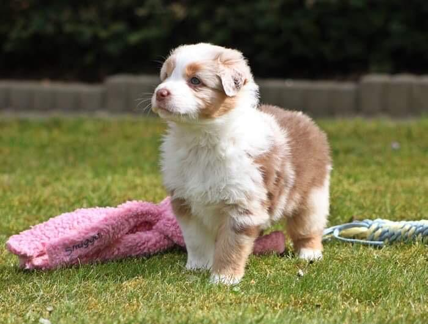

*FRIEDA* is an acronym for : **FR**amework for **I**nference and **E**xperimentation with **D**eterministic **A**utomata.
It is a comprehensive Rust-based framework for working with automata, transition systems, and automata learning algorithms. The project provides a collection of crates that enable implementation, inference, and experimentation with deterministic automata and related formal models.

<p align="center">
  <a href="https://frieda.photos" alt="more photos of Frieda"></a>
</p>

Since I am mad for my dog, an Australian Shepherd with the name Frieda, I obviously use her as inspiration for the name.
And of course it gives me a semi-good reason to show off how cute she is.
This project is stil very much in its early stages, so as temporary logo we use a picture of Frieda when she was still in her very early stages.
Lets hope that this project evolves more as this means I can replace the image with a more recent (even cuter) one, but for now you can also click the image for seeing more :)

## Features

This is a list of current and planned features to give a rough overview of what I would like this project to achieve

- **Core Automata Library**: Efficient implementations of (deterministic) transition systems and various constructions (restriction, recoloring, product construction, etc) that can be called on them.
Representation of standard acceptance conditions and automata types based on them.
- **Common Minimization Algorithms**: Procedures for minimization of both state- and transition-based automata (i.e. Moore and Mealy machines) by standard approaches such as Color Refinement.
- **Naive Determinization**: We include a naive determinization construction using powersets for going from nondeterministic finite automata to their deterministic counterpart. Implementation of determinization for omega-automata would be great but is not yet planned as that opens a whole new can of worms.
- **Learning Algorithms**: Tools for inferring automata over finite and infinite words either passively from given examples and actively by querying an oracle.
- **Visualisation**: Turning transition systems and automata into [graphviz](https://graphviz.org/) representation. Also, we can render those either by calling installed graphviz distribution or by using the [`layout`](https://graphviz.org/) crate. Finally, the visualisations can also be displayed through the system image viewer.
- **Hanoi Omega-Automata (HOA) format**: Support for parsing automata that are given in [HOA](https://adl.github.io/hoaf/), and for outputting automata in HOA.
- **Python Bindings**: Use *FRIEDA*'s functionality from Python (hopefully coming at some point)

This repository consists of several interconnected crates, which we list out and briefly describe now:

- `automata-core`: Core data structures and traits for working with transition systems and automata
- `automata`: Main package with high-level automata functionality. This crate also defines common acceptance conditions and provides structs combining transition systems with them.
- `automata-learning`: Implementations of automata learning algorithms, this includes active and passive algorithms.
- `hoars`: Support for the [HOA format](https://adl.github.io/hoaf/) through which omega-automata can be represented.
- `python`: Python bindings (that will hopefully be implemented soon)

## Quick Start

For working with automata from rust, add FRIEDA to your project by including the relevant crates in your `Cargo.toml`.

```toml
[dependencies]
automata-core = "0.1.0"
automata-learning = "0.1.0"
automata = "0.1.0"
# Add other crates as needed
```

To see how you can quickly start working with the libraries, check out the crate specific documentations.
You can find them by either navigating to the appropriate subdirectories or by clicking on the appropriate link: [automata](automata/README.md), [automata-learning](automata-learning/README.md)

## Command Line Tools

This framework also includes cli tool(s) for working with automata and related structures.
You can install them with `cargo install` by passing the appropriate subdirectory of the `bin` folder.
To install, for example, the *omega automata interaction* tool `oai`, you can run
```shell
cargo install --locked --path bin/oai
```
This command uses the locked version of the dependencies as that is guaranteed to compile.

## Examples

As typical for rust repositories, code examples are organised in a `tests` module that is scattered throughout the source code.
Also check out the `examples` directory for example files such as automata in `hoa` format.

## Documentation

Each crate has its own documentation, which per default is available for the latest released version on [docs.rs](docs.rs).
If you would like to locally document the current version, this can be done through invoking [`cargo doc`](https://doc.rust-lang.org/cargo/commands/cargo-doc.html).
For most use cases, it should be sufficient to simply execute
```shell
cargo doc --locked --workspace --no-deps --open
```
which will document the full workspace, not document any dependencies and subsequently open the documentation in your default browser.

## Contributing

Contributions are always welcome, so feel free to have a look at the issues and submit a pull request any time.
This is mostly a personal project and so bugs/missing features are to be expected.
Just play around with the code and see what you would like to change, I have not at all reached an impasse on how the crates and repository should be structured.
Any input you may have is immensely valuable.

The repostitory does not allow pushing to the `main` branch directly.
Instead, all changes have to go through a pull request.
Before such a request can be merged, it is verified that the resulting code builds on all major platforms (linux, macos, windows), that the formatting is correct, that clippy has no objections, and that all tests pass.
This is automatically done whenever a pull request is opened, and merging can only occur once all those tests have succeeded.

As running the tests in the cloud can take a while, it may be good to check adherence to the standards locally before even opening a pull request.
To do this, you can call `./check` (you may have to make it executable by calling `chmod +x check` before) or alternatively execute the commands it contains manually.

### License

This project is licensed under the MIT or Apache-2.0.
To be completely honest, I have only very rudimentary understanding of licensing.
There exists a `LICENSE.md` file, but that is mostly for good measure.
In principle, you can do whatever with the code, but it would be nice if you mention this repository when you use it.
If anybody has an idea how to accurately relect this in the license, write me a message or open a pull request.

### Contact

For questions, suggestions, or collaboration opportunities, please open an issue on GitHub or contact the maintainers directly.

<p align="right">
❤️
</p>

